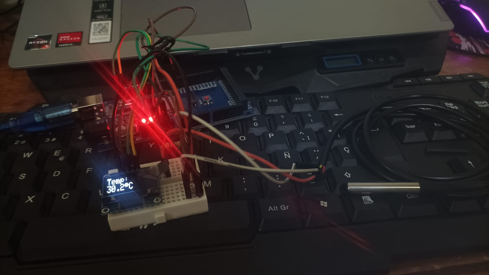

# Aplicación de la Ley 0 de la Termodinámica: Equilibrio Térmico con Arduino

En la física y la termodinámica, la **Ley 0** establece que si dos sistemas están en equilibrio térmico con un tercer sistema, entonces están en equilibrio térmico entre sí. Vamos a llevar a cabo un experimento práctico para demostrar este principio utilizando los siguientes materiales:

## Materiales

- **Arduino Uno**
- **Mini Protoboard**
- **Cables Macho-Macho**
- **Pantalla OLED 128x64**
- **Resistencia de 47 kΩ**
- **Sonda Sumergible DS18B20** (sensor de temperatura)

## Funcionamiento

### Sensor de Temperatura DS18B20
- El sensor DS18B20 es un dispositivo de medición de temperatura de alta precisión y bajo costo.
- Funciona midiendo la resistencia eléctrica en función de la temperatura, proporcionando así una lectura precisa.
- La placa Arduino se comunica con el sensor y obtiene la lectura de temperatura en grados Celsius.

### Pantalla OLED
- Utilizaremos una pantalla OLED para mostrar las lecturas de temperatura en tiempo real.
- La pantalla mostrará la temperatura en grados Celsius y Fahrenheit, facilitando la lectura para el usuario.

### Equilibrio Térmico
- Para verificar el equilibrio térmico entre dos sistemas (A y B), colocaremos el sensor DS18B20 en contacto con ambos.
- Si las temperaturas medidas por el sensor en ambos sistemas son iguales o muy cercanas, podemos concluir que están en equilibrio térmico según la Ley 0 de la Termodinámica.

## Pasos de Conexión

1. **Conexión del Sensor de Temperatura al Sistema A:**
   - Conectar el pin de datos del DS18B20 al pin 2 de la placa Arduino.
   - Conectar el pin de alimentación (VCC) del DS18B20 a la fuente de alimentación adecuada.
   - Conectar el pin de tierra (GND) del DS18B20 a la tierra de la placa Arduino.

2. **Conexión de la Pantalla OLED al Sistema B:**
   - Conectar el pin de datos (SDA) de la pantalla OLED al pin A4 (SDA) de la placa Arduino.
   - Conectar el pin de reloj (SCL) de la pantalla OLED al pin A5 (SCL) de la placa Arduino.
   - Conectar el pin de alimentación (VCC) de la pantalla OLED a la fuente de alimentación adecuada.
   - Conectar el pin de tierra (GND) de la pantalla OLED a la tierra de la placa Arduino.

3. **Conexión de la Placa Arduino a Ambos Sistemas:**
   - Asegurarse de que la placa Arduino esté alimentada y conectada tanto al sistema A como al sistema B.

4. **Inicio del Programa:**
   - Cargar el programa en la placa Arduino para iniciar la medición de temperatura y mostrarla en la pantalla OLED.
  

  

  <i>Esquemático</i>

## Conclusión

Esta aplicación práctica de la Ley 0 de la Termodinámica utilizando un sensor de temperatura y una pantalla OLED conectados a una placa Arduino demuestra cómo se puede verificar el equilibrio térmico entre dos sistemas físicos. La visualización en tiempo real de las temperaturas en la pantalla OLED facilita la comparación y verificación del equilibrio térmico según los principios fundamentales de la termodinámica. Este experimento proporciona una herramienta útil y didáctica para estudiar y comprender conceptos termodinámicos básicos de una manera interactiva y accesible.

---

  

  <i>REPRESENTACION</i>

